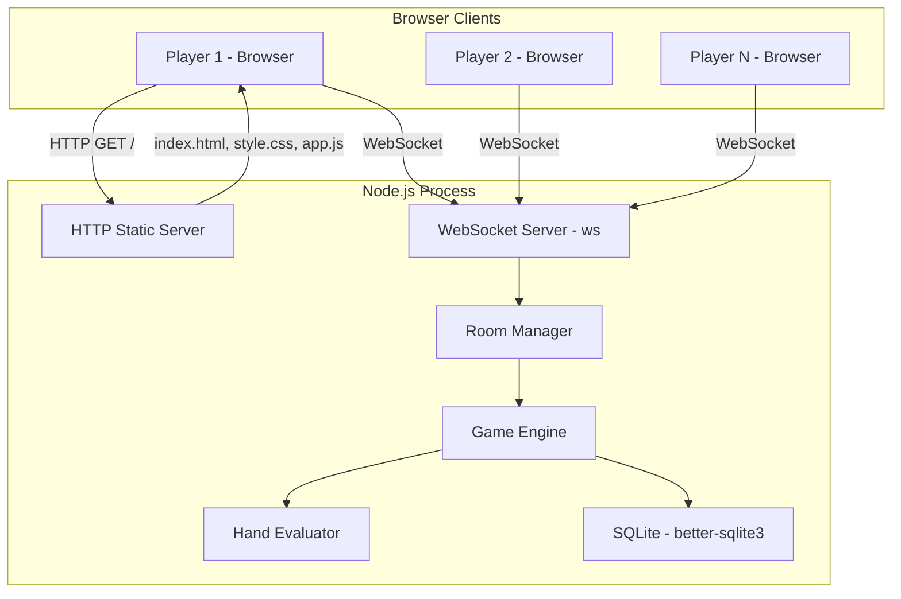
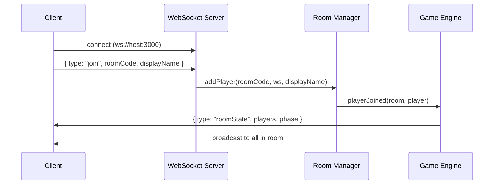
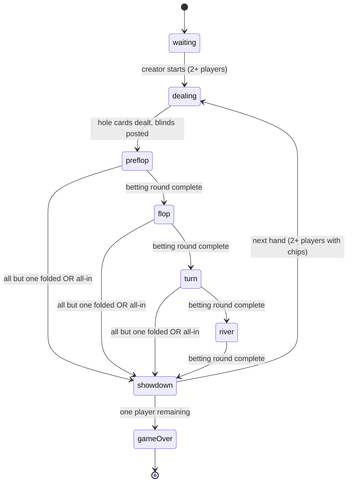

# Multiplayer Browser-Based Poker Game — Detailed Design

## Overview

A self-hosted, multiplayer Texas Hold'em poker game played in the browser. Players join rooms via shareable codes, play tournament-style games with escalating blinds, and compete until one player has all chips. The server is authoritative — all game logic runs server-side to prevent cheating.

The system prioritizes **code simplicity** above all else: 2 npm dependencies, 1 language (JavaScript), no frameworks, no build step.

---

## Detailed Requirements

### Game Rules
- **Variant:** Texas Hold'em (2 hole cards, 5 community cards, best 5-card hand wins)
- **Table size:** 6 players maximum
- **Format:** Tournament-style — fixed buy-in, no re-buys, escalating blinds
- **Win condition:** Last player with chips wins the room
- **Blind escalation:** Hand-based (blinds increase every N hands dealt)
- **Turn timer:** 30 seconds per action; auto-fold on timeout
- **Actions:** Fold, check, call, bet, raise, all-in
- **Side pots:** Properly handled when a player goes all-in for less than the current bet

### Player Experience
- **Identity:** Anonymous guests — pick a display name on join (no accounts)
- **Room access:** Join via room code (no public lobby)
- **Room creation:** Any player can create a room, receiving a shareable code
- **Game start:** Room creator manually starts the game
- **Elimination:** Eliminated players enter spectator mode (can watch but not act)
- **Disconnection:** Player is marked "sitting out" — posts blinds, auto-folds until reconnection
- **Room end:** Room destroyed when one winner emerges or all players leave

### User Interface
- **Platform:** Desktop browsers only (no mobile support)
- **Style:** Minimalist/clean
- **Animations:** None
- **Chat/Emotes:** None
- **Displayed information:** Pot size, each player's chip count, community cards, current blind level
- **No sound effects**

### Anti-Cheating
- **Server-authoritative:** All card dealing, hand evaluation, and pot calculations happen server-side
- **Information hiding:** Clients only receive their own hole cards (other players' cards are hidden until showdown)
- **Action validation:** Server rejects invalid actions (wrong turn, illegal bet size, invalid action type)

### Data Storage
- **Database:** SQLite (single file)
- **Stats tracked:** Per-session player statistics (hands played, hands won, biggest pot, peak chips, final position)
- **Retention:** Persisted on disk indefinitely (tiny data volume)

### Infrastructure
- **Hosting:** Self-hosted on a laptop
- **Scale:** Small (< 10 concurrent rooms)
- **Deployment:** Manual (`node server.js`)
- **Configuration:** All game parameters hardcoded with sensible defaults

### Hardcoded Defaults
| Parameter | Value |
|-----------|-------|
| Starting chips | 1000 |
| Starting blinds | 10/20 |
| Hands per blind level | 10 |
| Blind multiplier | 2x (doubling each level) |
| Max players per table | 6 |
| Turn timer | 30 seconds |

---

## Architecture Overview



### Single-Process Architecture

Everything runs in one Node.js process:
1. **HTTP server** (built-in `http` module) serves static files (HTML/CSS/JS)
2. **WebSocket server** (`ws`) handles real-time bidirectional communication
3. **Room Manager** maps room codes to game state objects
4. **Game Engine** processes actions, validates moves, advances game phases
5. **Hand Evaluator** determines winning hands at showdown
6. **SQLite** (`better-sqlite3`) stores session stats

No inter-process communication. No message queues. No external services.

---

## Components and Interfaces

### 1. HTTP Static Server

Serves the client application. Three files:
- `public/index.html` — page structure
- `public/style.css` — minimalist styling
- `public/app.js` — game client logic + WebSocket communication

Implementation: ~15 lines using Node's `http` module and `fs.createReadStream`.

### 2. WebSocket Server

Manages connections, routes messages to the Room Manager.

**Connection flow:**


**Message protocol (Client → Server):**

| Message Type | Fields | Description |
|-------------|--------|-------------|
| `create` | `displayName` | Create a new room |
| `join` | `roomCode`, `displayName` | Join existing room |
| `start` | — | Creator starts the game |
| `action` | `action`, `amount?` | Player game action |
| `leave` | — | Player leaves room |

**Message protocol (Server → Client):**

| Message Type | Fields | Description |
|-------------|--------|-------------|
| `roomCreated` | `roomCode` | Confirms room creation |
| `roomState` | `players`, `phase`, `pot`, `communityCards`, `blindLevel`, `activePlayer`, `yourCards` | Full state update |
| `yourTurn` | `validActions`, `timeRemaining` | Prompts active player |
| `error` | `message` | Validation error |
| `gameOver` | `winner`, `stats` | Game has ended |

**Key design decisions:**
- All communication is JSON-encoded strings
- Server sends filtered state per player (each player only sees their own hole cards)
- Broadcasts happen after every state change
- Client connection identified by a generated `playerId` (UUID stored in-memory, sent on reconnect)

### 3. Room Manager

Maintains a `Map<roomCode, Room>` of active rooms.

**Responsibilities:**
- Generate unique 6-character room codes
- Create/destroy rooms
- Route player connections to correct room
- Handle reconnection (match by `playerId`)
- Detect and destroy empty rooms

**Interface:**
```js
// Room Manager API
createRoom(creatorWs, displayName) → roomCode
joinRoom(roomCode, ws, displayName) → { success, error? }
reconnect(roomCode, playerId, ws) → { success, error? }
leaveRoom(roomCode, playerId) → void
getRoom(roomCode) → room | null
```

### 4. Game Engine

The core game logic. Operates on a room's state object.

**State machine:**



**Betting round logic:**
1. Set active player to first to act (position-dependent)
2. Start 30-second timer
3. Wait for action or timeout (auto-fold)
4. Validate and apply action
5. Advance to next active player (skip folded/all-in)
6. If betting round complete (all players have acted and bets are matched), advance phase

**Side pot calculation:**
When a player goes all-in for less than the current bet, a side pot is created. Players only compete for pots they're eligible for. Implementation tracks multiple pot objects with eligibility lists.

**Blind escalation:**
After every `HANDS_PER_LEVEL` (10) hands dealt, the blind level increases:
- Level 0: 10/20
- Level 1: 20/40
- Level 2: 40/80
- Level 3: 80/160
- Level 4: 160/320
- ...continues doubling

### 5. Hand Evaluator

Custom implementation (~200 lines). Evaluates the best 5-card hand from 7 cards.

**Interface:**
```js
evaluateHand(sevenCards) → { rank, score, description }
// rank: 0-9 (HIGH_CARD to ROYAL_FLUSH)
// score: numeric value for comparison (higher is better, handles kickers)
// description: "Pair of Kings, Ace kicker"

compareHands(handA, handB) → -1 | 0 | 1
// For determining winner/split pot
```

**Approach:**
1. Generate all 21 five-card combinations from 7 cards
2. Score each combination (rank + kicker encoding)
3. Return the highest-scoring combination
4. Compare scores numerically to determine winners

**Edge cases:**
- Ace-low straight (A-2-3-4-5, "the wheel")
- Split pots (equal scores)
- Multiple side pots with different eligible players
- Kicker comparison for same hand rank

### 6. Database Layer

**Schema:**

```sql
CREATE TABLE sessions (
  id TEXT PRIMARY KEY,
  room_code TEXT NOT NULL,
  created_at TEXT DEFAULT (datetime('now')),
  ended_at TEXT,
  winner_name TEXT
);

CREATE TABLE player_stats (
  id INTEGER PRIMARY KEY AUTOINCREMENT,
  session_id TEXT NOT NULL,
  player_name TEXT NOT NULL,
  hands_played INTEGER DEFAULT 0,
  hands_won INTEGER DEFAULT 0,
  biggest_pot INTEGER DEFAULT 0,
  peak_chips INTEGER DEFAULT 0,
  final_position INTEGER,
  FOREIGN KEY (session_id) REFERENCES sessions(id)
);

CREATE INDEX idx_stats_session ON player_stats(session_id);
```

**Write timing:**
- Session start: Insert session + player_stats rows
- Hand end: Increment hands_played for all participants, update hands_won/biggest_pot for winner
- Game end: Set final_position for all players, ended_at and winner_name on session

**Read timing:**
- On `gameOver`: Query final stats for the session, send to all clients

---

## Data Models

### Room State (In-Memory)

```js
{
  code: "ABC123",
  phase: "preflop",       // waiting|dealing|preflop|flop|turn|river|showdown|gameOver
  players: [
    {
      id: "uuid-1",
      name: "Alice",
      ws: <WebSocket>,
      chips: 950,
      cards: [{ rank: 14, suit: 'h' }, { rank: 11, suit: 'd' }],
      currentBet: 20,
      folded: false,
      allIn: false,
      sittingOut: false,
      isCreator: true
    }
  ],
  spectators: [           // eliminated players still connected
    { id: "uuid-3", name: "Charlie", ws: <WebSocket> }
  ],
  deck: [...],            // remaining cards
  communityCards: [],     // 0-5 cards
  pots: [{ amount: 150, eligible: ["uuid-1", "uuid-2"] }],
  currentBet: 40,         // highest bet this round
  activePlayerIndex: 2,
  dealerIndex: 0,
  smallBlindIndex: 1,
  bigBlindIndex: 2,
  blindLevel: 0,
  handNumber: 0,
  handsThisLevel: 0,
  timer: null,            // setTimeout reference
  sessionId: "sess-xyz"  // links to SQLite
}
```

### Card Representation

```js
{ rank: 14, suit: 'h' }  // Ace of hearts
// rank: 2-14 (2 through Ace)
// suit: 'h', 'd', 'c', 's'
```

### Client State (Sent via WebSocket)

Each player receives a **filtered** view:
```js
{
  type: "roomState",
  phase: "flop",
  players: [
    { name: "Alice", chips: 950, currentBet: 40, folded: false, allIn: false, sittingOut: false, isDealer: true },
    { name: "Bob", chips: 800, currentBet: 40, folded: false, allIn: false, sittingOut: false, isDealer: false },
    // ... no card info for other players
  ],
  yourCards: [{ rank: 14, suit: 'h' }, { rank: 11, suit: 'd' }],  // only your own
  communityCards: [{ rank: 10, suit: 'h' }, { rank: 9, suit: 'h' }, { rank: 2, suit: 'c' }],
  pot: 150,
  currentBet: 40,
  blindLevel: { small: 10, big: 20 },
  activePlayer: "Bob",
  handNumber: 3
}
```

At showdown, all remaining players' cards are revealed.

---

## Error Handling

### Client-Side Errors
| Scenario | Response |
|----------|----------|
| Invalid room code | `{ type: "error", message: "Room not found" }` |
| Room is full | `{ type: "error", message: "Room is full" }` |
| Game already started | `{ type: "error", message: "Game already in progress" }` |
| Duplicate display name | `{ type: "error", message: "Name already taken in this room" }` |

### Game Action Errors
| Scenario | Response |
|----------|----------|
| Not your turn | `{ type: "error", message: "Not your turn" }` |
| Invalid action | `{ type: "error", message: "Invalid action" }` |
| Bet too small | `{ type: "error", message: "Minimum raise is X" }` |
| Bet exceeds stack | `{ type: "error", message: "Insufficient chips" }` |

### Connection Errors
| Scenario | Server Behavior |
|----------|-----------------|
| Player disconnects mid-hand | Mark as sittingOut, auto-fold current hand, post blinds on future hands |
| Player reconnects | Match by playerId, restore WebSocket reference, send current state |
| All players disconnect | Destroy room after brief delay (5 seconds) |
| Malformed message | Ignore message, send `{ type: "error", message: "Invalid message format" }` |

### Server Errors
- SQLite write failure: Log error, continue game (stats are non-critical)
- Unhandled exception in game logic: Log, send error to room, attempt to recover state

---

## Testing Strategy

### Unit Tests
- **Hand evaluator:** Exhaustive test suite with known hands — pairs, straights, flushes, full houses, edge cases (wheel straight, split pot kickers)
- **Betting logic:** Valid action computation, pot calculation, side pot creation
- **Blind escalation:** Level progression, correct blind posting
- **Phase transitions:** Correct flow from preflop through showdown
- **Action validation:** Reject out-of-turn, invalid bets, impossible actions

### Integration Tests
- **Full hand simulation:** Deal cards, play through all rounds to showdown, verify winner
- **Multi-hand session:** Play multiple hands, verify dealer rotation, blind rotation, chip persistence
- **Side pot scenarios:** Multiple all-ins at different amounts
- **Elimination flow:** Player loses all chips → spectator mode → game continues

### System Tests
- **WebSocket communication:** Connect, join room, play hand, verify messages
- **Reconnection:** Disconnect mid-hand, reconnect, verify state restoration
- **Concurrent rooms:** Multiple games running independently
- **Timer enforcement:** Verify auto-fold at 30 seconds

### Test Approach
- Use Node's built-in `assert` module (or `node:test` runner in Node 20+)
- Test game logic as pure functions — no WebSocket mocking needed for core logic
- WebSocket integration tests create real connections to a test server
- No external testing frameworks to maintain zero-dependency philosophy

---

## Appendices

### A. Technology Choices

| Component | Choice | Alternatives Considered | Why This One |
|-----------|--------|------------------------|--------------|
| Runtime | Node.js | Python, Go | Same language as client, single-process simplicity |
| HTTP | Built-in `http` | Express, Fastify | Zero deps, only serves 3 static files |
| WebSocket | `ws` | Socket.IO, uWebSockets | 1 dep, zero transitive, no client library needed |
| Database | `better-sqlite3` | sql.js, sqlite3, PostgreSQL | Synchronous API avoids async complexity in game loop |
| Frontend | Vanilla HTML/CSS/JS | React, Vue, Svelte | No build step, no framework overhead |
| Hand eval | Custom (~200 lines) | pokersolver, poker-evaluator | Zero deps, full debuggability |
| Test runner | `node:test` (built-in) | Jest, Mocha | Zero deps |

### B. Research Findings Summary

1. **Real-time communication:** Raw WebSocket is sufficient. Socket.IO's room abstraction saves ~10 lines but adds 15 transitive deps and a required client library. Room management via `Map<code, Set<ws>>` is trivial.

2. **Backend framework:** No framework needed. The app has one HTTP concern (serve static files) and zero REST endpoints. A 15-line static file handler replaces Express entirely.

3. **Hand evaluation:** Custom implementation preferred at this scale (126 evaluations per hand, <1ms). Numeric scoring system enables simple comparison. `pokersolver` is acceptable fallback if custom takes too long.

4. **State management:** Flat mutable objects with handler functions. No Redux, no event sourcing, no OOP classes. Phase tracked as a string field, transitions via switch statement, timers via setTimeout.

5. **SQLite integration:** Synchronous writes at hand-end only (~0.1ms each). No risk of blocking the event loop. WAL mode for safety. Schema is 2 tables with 1 index.

### C. Alternative Approaches Considered

1. **Socket.IO for rooms:** Rejected — adds complexity and client library for a feature implementable in 10 lines.
2. **Express for HTTP:** Rejected — only value is `express.static()`, achievable in 15 lines of vanilla code.
3. **PostgreSQL for storage:** Rejected — requires running a database server, overkill for per-session stats on a laptop.
4. **React/Vue for frontend:** Rejected — adds build step, increases complexity, not needed for a static table layout.
5. **Event sourcing for game state:** Rejected — over-engineered for ephemeral play-money games.
6. **TypeScript:** Considered but rejected for this iteration — adds build step and complexity. Could be added later if codebase grows.

### D. File Structure

```
poker-game/
├── server.js              # Entry point: HTTP + WebSocket server
├── game-engine.js         # Game state machine + action handlers
├── hand-evaluator.js      # Custom Texas Hold'em hand evaluation
├── room-manager.js        # Room creation, joining, lifecycle
├── db.js                  # SQLite schema + prepared statements
├── public/
│   ├── index.html         # Single page with table layout
│   ├── style.css          # Minimalist desktop styling
│   └── app.js             # Client: WebSocket + DOM updates
├── test/
│   ├── hand-evaluator.test.js
│   ├── game-engine.test.js
│   └── integration.test.js
├── data/
│   └── poker.db           # SQLite database (created at runtime)
├── package.json
└── README.md
```

### E. Constraints and Limitations

- **No persistence across restarts:** In-memory game state is lost if the server crashes. Acceptable for casual play.
- **Single machine:** No horizontal scaling. Limited to what one laptop can handle (~10 rooms, ~60 players).
- **No authentication:** Players can impersonate names. Acceptable for friend groups using private room codes.
- **No spectator join:** Only eliminated players spectate. No "watch a game" for outsiders.
- **SQLite single-writer:** Only one process can write. Not an issue with single-process architecture.
- **No HTTPS:** Self-hosted on LAN assumes trusted network. Could add via reverse proxy if needed.
