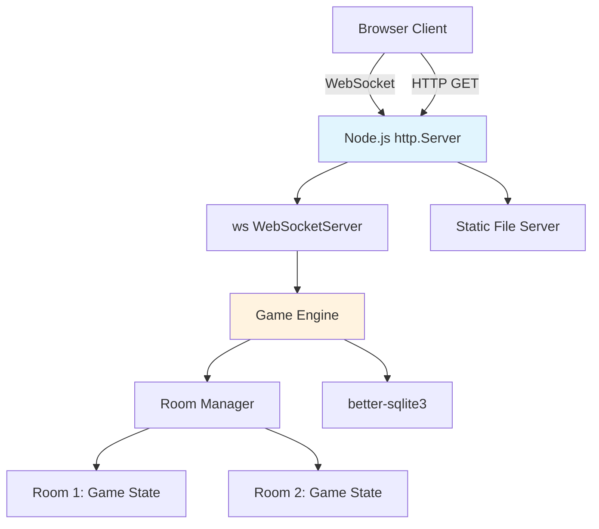

# Backend Framework Research

## Overview

The backend needs to:
1. Serve static files (HTML/CSS/JS for the client)
2. Handle WebSocket connections for real-time gameplay
3. Manage game state in memory (multiple rooms)
4. Store stats in SQLite
5. Run on a laptop, single process

## Options Considered

### 1. Node.js — No Framework (built-in `http` + `ws`)

- **Dependencies:** `ws` (WebSocket), `better-sqlite3` (SQLite)
- **Boilerplate:** Minimal. Node's `http` module serves static files in ~15 lines.
- **WebSocket integration:** `ws` attaches directly to the `http.Server` instance
- **Language:** JavaScript — same as the client, one language for the whole project

```js
const http = require('http');
const { WebSocketServer } = require('ws');
const server = http.createServer(serveStatic);
const wss = new WebSocketServer({ server });
server.listen(3000);
```

### 2. Node.js — Express + `ws`

- **Dependencies:** `express`, `ws`, `better-sqlite3`
- **Boilerplate:** Slightly more than raw `http`
- **Benefit:** `express.static()` is convenient, routing is cleaner for REST
- **Downside:** Express adds middleware concepts you barely use

### 3. Python — FastAPI + `websockets`

- **Dependencies:** `fastapi`, `uvicorn`, `websockets`, `aiosqlite`
- **Boilerplate:** Medium — async Python, type hints, ASGI lifecycle
- **Downside:** Two languages (Python backend, JS frontend). Async Python has gotchas.

### 4. Python — Flask + Flask-SocketIO

- **Dependencies:** `flask`, `flask-socketio`, `eventlet` or `gevent`
- **Boilerplate:** Medium-high — requires async runtime, monkey-patching
- **Downside:** Complex async story, heavier than it looks

### 5. Go — `net/http` + `gorilla/websocket`

- **Dependencies:** Standard library + 1
- **Boilerplate:** Medium — Go is verbose but explicit
- **Benefit:** Single binary deployment, great concurrency
- **Downside:** Different language from frontend, more verbose, slower iteration

## Comparison Matrix

| Criteria | Node (raw http) | Node (Express) | Python (FastAPI) | Go |
|----------|-----------------|----------------|------------------|-----|
| Total deps | 2 | 3 | 4+ | 1 |
| Lines to bootstrap | ~20 | ~25 | ~30 | ~50 |
| Same language as client | Yes | Yes | No | No |
| WebSocket integration | Native | Native | Good | Good |
| SQLite support | Excellent (sync) | Excellent (sync) | Async only | Good |
| Deployment | `node server.js` | `node server.js` | `uvicorn main:app` | Single binary |

## Architecture



## Recommendation: Node.js with raw `http` module + `ws`

**No framework. Just Node's built-in `http` server with the `ws` package.**

### Rationale

1. **Two production dependencies total:** `ws` + `better-sqlite3`
2. **One language:** JavaScript everywhere — client and server share card/hand logic
3. **Zero framework overhead:** No middleware chains, no plugin systems
4. **Static file serving is trivial:** For a single-page app with 3 files, a 15-line handler suffices
5. **WebSocket is the primary protocol:** This is a WebSocket app that serves its own HTML, not a REST API
6. **Deployment:** `node server.js` — nothing simpler
7. **Debugging:** One process, synchronous game logic, console.log

### Why not Express?

Express adds value when you have many HTTP routes, middleware needs (auth, CORS, body parsing). This app has:
- One HTTP concern: serve static files
- Zero REST endpoints (all game logic over WebSocket)
- No auth (anonymous guests)
- No CORS (same-origin)

### Why not Python/Go?

- **Two languages** means context-switching and no code sharing
- Python's async story adds cognitive overhead
- Go is more verbose for the same logic
- Neither buys anything for a 6-player laptop game

### Tradeoffs

- **No `express.static()`:** Must write a simple static file handler (~15 lines, one-time cost)
- **No routing framework:** All "routing" is WebSocket message types — a switch statement
- **No middleware:** Validation lives in the game engine. For anonymous poker, nothing to middleware.
- **Less structure for growth:** If this became a product with REST APIs, you'd want Express. Not needed here.

### Bootstrap code

```js
const http = require('http');
const fs = require('fs');
const path = require('path');
const { WebSocketServer } = require('ws');

const server = http.createServer((req, res) => {
  const filePath = path.join(__dirname, 'public', req.url === '/' ? 'index.html' : req.url);
  const stream = fs.createReadStream(filePath);
  stream.on('error', () => { res.writeHead(404); res.end(); });
  stream.pipe(res);
});

const wss = new WebSocketServer({ server });
wss.on('connection', handleConnection);

server.listen(3000, () => console.log('Poker server on :3000'));
```

Total: 14 lines for a working HTTP + WebSocket server.
