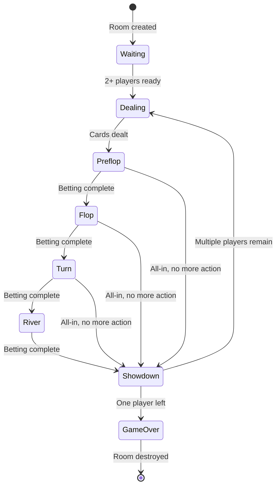
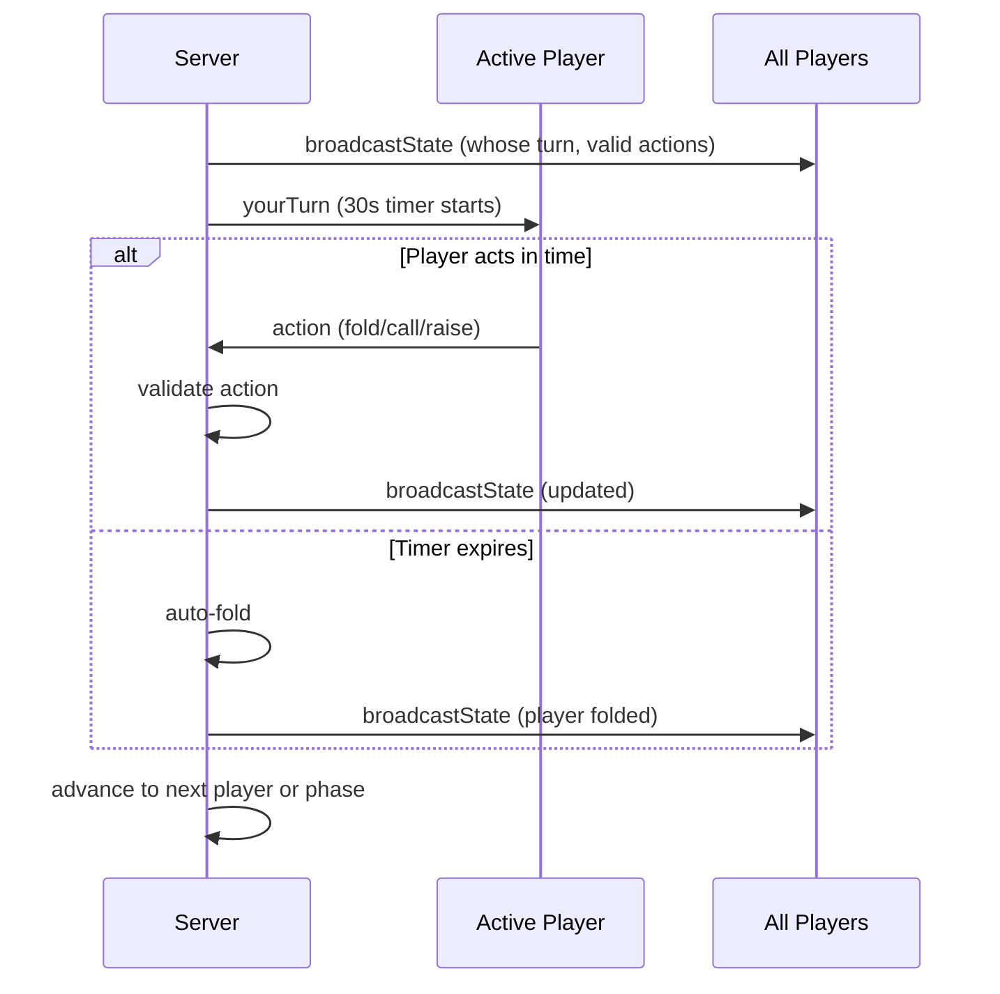

# Game State Management Research

## Overview

The server must manage authoritative game state for multiple simultaneous rooms. State includes: player positions, chip counts, cards, betting rounds, pot(s), blinds, timers, and game phase. The server validates all actions and broadcasts updates.

## Patterns Considered

### 1. Flat Object per Room (Mutable State + Handler Functions)

Each room is a plain JavaScript object. Functions mutate state directly.

- **Complexity:** Low
- **Testability:** High — functions take state object, easy to set up
- **Debugging:** `console.log(room)` shows everything

### 2. Event Sourcing

Store every action as an event; derive current state by replaying.

- **Complexity:** High
- **Benefit:** Full history, replay, undo
- **Downside:** Over-engineered for play-money poker

### 3. Redux-like Reducer (Immutable transitions)

`state + action -> newState` via pure reducer functions.

- **Complexity:** Medium
- **Benefit:** Predictable, easy to test
- **Downside:** Immutable copying adds boilerplate at this scale

### 4. OOP Classes (Room, Game, Player, Deck)

Classes with methods that mutate internal state.

- **Complexity:** Medium
- **Benefit:** Familiar encapsulation
- **Downside:** Mutations harder to track, testing requires more setup

## Room Lifecycle



## Turn Flow with Timer



## Recommendation: Flat State Object + Handler Functions

**Use a plain object per room, mutated by organized handler functions.**

### Rationale

1. **Simplest mental model:** Game state is one object — `console.log(room)` shows everything
2. **Handler functions are testable:** Each takes state + action, easy to test in isolation
3. **Mutation is fine at this scale:** No immutability overhead, just mutate and broadcast
4. **No framework:** No Redux, no state machine library. A `phase` field + switch is clear.
5. **Timer is `setTimeout`:** No scheduler library needed

### State Structure

```js
function createRoom(code) {
  return {
    code,
    phase: 'waiting', // waiting|preflop|flop|turn|river|showdown
    players: [],       // { id, name, chips, cards, currentBet, folded, allIn }
    spectators: [],    // eliminated players watching
    deck: [],
    communityCards: [],
    pots: [{ amount: 0, eligible: [] }],
    currentBet: 0,
    activePlayerIndex: -1,
    dealerIndex: 0,
    blindLevel: 0,
    handNumber: 0,
    timer: null,
  };
}
```

### Action Handling

```js
function handleAction(room, playerId, action) {
  if (room.players[room.activePlayerIndex].id !== playerId) {
    return { error: 'Not your turn' };
  }
  if (!isValidAction(room, action)) {
    return { error: 'Invalid action' };
  }

  switch (action.type) {
    case 'fold':  return handleFold(room, playerId);
    case 'check': return handleCheck(room, playerId);
    case 'call':  return handleCall(room, playerId);
    case 'bet':   return handleBet(room, playerId, action.amount);
    case 'raise': return handleRaise(room, playerId, action.amount);
    case 'allIn': return handleAllIn(room, playerId);
  }
}
```

### Validation

```js
function getValidActions(room) {
  const player = room.players[room.activePlayerIndex];
  const actions = ['fold'];
  
  if (room.currentBet === player.currentBet) actions.push('check');
  if (room.currentBet > player.currentBet) actions.push('call');
  if (player.chips > room.currentBet - player.currentBet) {
    actions.push(room.currentBet === 0 ? 'bet' : 'raise');
  }
  actions.push('allIn');
  return actions;
}
```

### Phase Advancement

```js
function advancePhase(room) {
  clearTimeout(room.timer);
  if (countActivePlayers(room) === 1) return awardPot(room);
  
  switch (room.phase) {
    case 'preflop': return startFlop(room);
    case 'flop':    return startTurn(room);
    case 'turn':    return startRiver(room);
    case 'river':   return startShowdown(room);
  }
}
```

### Multi-Room Management

```js
const rooms = new Map(); // roomCode -> room state object

function getRoom(code) { return rooms.get(code); }
function removeRoom(code) { rooms.delete(code); }
// Linear scan is fine for <100 rooms on a laptop
```

### Tradeoffs

- **No event history:** Can't replay hands after completion. Could log to SQLite if needed.
- **Mutation risks:** A bug could corrupt state. Mitigated by small, tested handlers.
- **Single process:** All state in memory. Server crash loses all games. Acceptable for laptop use.
- **No persistence:** Games don't survive restart. Fine for this scope.

### Complexity Note: Side Pots

When a player goes all-in for less than the current bet, side pots are created. This is the trickiest logic (~30-50 lines). Test it thoroughly with multiple all-in scenarios.
