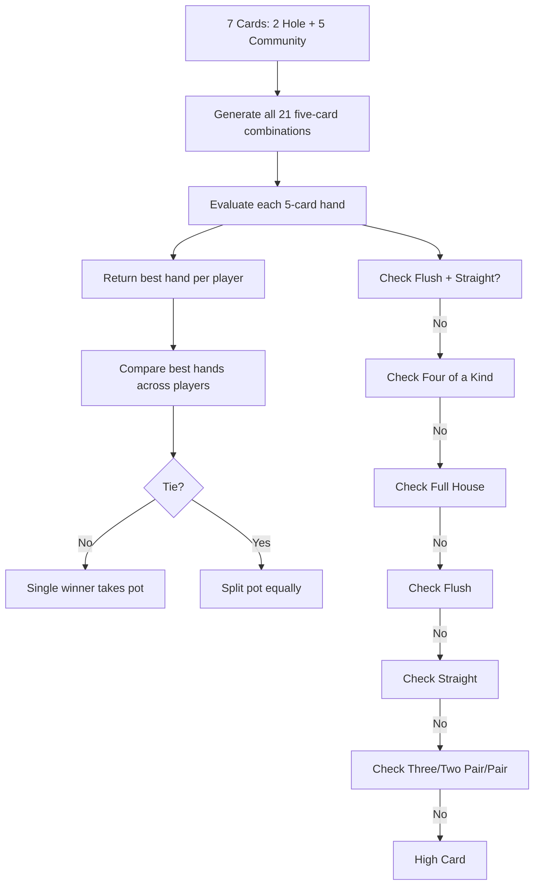

# Poker Hand Evaluation Research

## Overview

Texas Hold'em requires evaluating the best 5-card hand from 7 cards (2 hole + 5 community) and ranking hands against each other to determine winners, including split pots.

Hand rankings (high to low): Royal Flush, Straight Flush, Four of a Kind, Full House, Flush, Straight, Three of a Kind, Two Pair, One Pair, High Card.

## Options Considered

### 1. Lookup Table Libraries (e.g., `poker-evaluator`)

Pre-computed lookup tables for constant-time hand evaluation.

- **Speed:** Extremely fast
- **Complexity:** Tables are opaque — hard to understand or debug
- **Dependencies:** 1 library (black box)

### 2. Algorithmic Library: `pokersolver`

Readable algorithm-based evaluation. Popular, well-tested.

- **API:** `Hand.solve(['Ah', 'Kh', 'Qh', 'Jh', 'Th', '2c', '3d'])`
- **Dependencies:** 1 (zero transitive)
- **Size:** ~30KB
- **Benefit:** Handles 2-7 cards, comparison, hand descriptions
- **Downside:** External dependency, less control

### 3. Custom Implementation

Write hand evaluation from scratch.

- **Lines of code:** ~150-250 for a complete evaluator
- **Approach:** Sort cards, check patterns top-down (flush? straight? n-of-a-kind?)
- **Benefit:** Zero dependencies, full understanding, easy to debug
- **Downside:** Must handle all edge cases manually

### 4. Cactus Kev / Two Plus Two Algorithm

Classic algorithms using perfect hash functions and bit manipulation.

- **Speed:** Millions of evaluations per second
- **Complexity:** Very clever but very hard to read or modify
- **Relevance:** Overkill for 6-player tables evaluating once per hand

## Comparison

| Criteria | Lookup Table | pokersolver | Custom | Cactus Kev |
|----------|-------------|-------------|--------|------------|
| Dependencies | 1 | 1 | 0 | 0 |
| Code clarity | Low | High | Highest | Very Low |
| Correctness confidence | High | High | Must test well | High |
| Your code required | ~0 lines | ~0 lines | ~200 lines | ~100 lines |
| Performance | Fastest | Fast | Fast enough | Fastest |
| Debuggability | Low | Medium | Highest | Low |

## Evaluation Flow



## Recommendation: Custom Implementation

**Write a hand evaluator from scratch (~200 lines of JS).**

### Rationale

1. **Zero dependencies** — the evaluator is pure logic with no external code
2. **Full understanding** — you know exactly how every hand is scored
3. **Easy to debug** — when a player disputes a result, trace through readable code
4. **One-time cost** — write it once, poker rules never change
5. **Performance is irrelevant** — 6 players x 21 combinations = 126 evaluations per hand, <1ms even naive
6. **Testable** — write a suite with known hands, verify correctness exhaustively

### Implementation Strategy

Use a numeric scoring system where each hand maps to a comparable number:

```js
// Hand rank (0-9) as high-order value + kickers for tiebreaking
// Higher number = better hand

const HAND_RANKS = {
  HIGH_CARD: 0, ONE_PAIR: 1, TWO_PAIR: 2, THREE_KIND: 3,
  STRAIGHT: 4, FLUSH: 5, FULL_HOUSE: 6, FOUR_KIND: 7,
  STRAIGHT_FLUSH: 8, ROYAL_FLUSH: 9
};

function evaluateFive(cards) {
  const sorted = [...cards].sort((a, b) => b.rank - a.rank);
  const flush = cards.every(c => c.suit === cards[0].suit);
  const straight = isStraight(sorted);
  
  if (flush && straight) return score(HAND_RANKS.STRAIGHT_FLUSH, sorted);
  // ... check each hand type top-down
}

function bestOfSeven(sevenCards) {
  let best = 0;
  for (const combo of combinations(sevenCards, 5)) {
    best = Math.max(best, evaluateFive(combo));
  }
  return best;
}
```

### Key Details

- **Scoring:** Base score per rank (e.g., flush = 5,000,000) + kicker encoding so Flush-A-K > Flush-A-Q via numeric comparison
- **Combinations:** C(7,5) = 21 — brute-force is fine
- **Ace-low straight:** Special case for A-2-3-4-5 (the "wheel")
- **Kickers:** Encode remaining cards in descending order for tiebreaking
- **Comparison:** Simple `score1 > score2`

### Tradeoffs

- **Development time:** ~2-4 hours to write + test vs. 5 min for `npm install pokersolver`
- **Edge case risk:** Must handle wheel straight, kicker comparison, split pots with odd chips
- **Testing burden:** Need comprehensive test suite (but this is good practice)

### Fallback: `pokersolver`

If custom proves too time-consuming, `pokersolver` is acceptable:
- Zero transitive dependencies
- Clean API, well-tested by community
- ~30KB, readable source

Custom is recommended first for alignment with "understand everything" philosophy.
