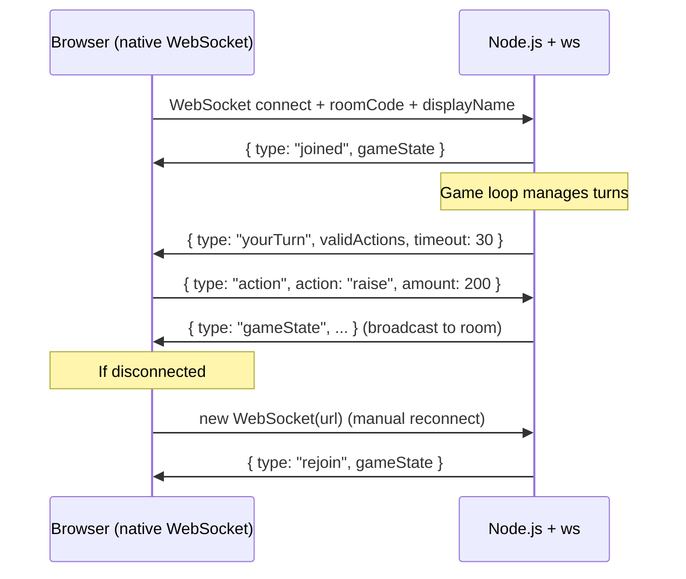

# Real-Time Communication Research

## Overview

A multiplayer poker game requires bidirectional real-time communication. The server pushes game state updates and clients send player actions. WebSockets are the right transport.

## Options Considered

### 1. Raw `ws` (Node.js)

The `ws` package is the most popular pure WebSocket implementation for Node.js.

- **Dependencies:** 1 (`ws`) with zero transitive deps
- **Boilerplate:** Minimal — create server, listen, send/receive JSON
- **Features:** Raw WebSocket protocol only. No auto-reconnect, no rooms, no acknowledgments.
- **Size:** ~50KB installed

```js
const WebSocket = require('ws');
const wss = new WebSocket.Server({ server: httpServer });

wss.on('connection', (ws) => {
  ws.on('message', (data) => {
    const msg = JSON.parse(data);
  });
  ws.send(JSON.stringify({ type: 'gameState', ...state }));
});
```

### 2. Socket.IO

Full-featured real-time framework with rooms, namespaces, auto-reconnect, and fallback transports.

- **Dependencies:** 1 (`socket.io`) but pulls in ~15 transitive deps
- **Boilerplate:** Low-medium. Built-in rooms abstraction is convenient.
- **Features:** Auto-reconnect, rooms, namespaces, acknowledgments, binary support
- **Size:** ~1.5MB installed (server + client library required)

### 3. µWebSockets.js (uWS)

High-performance C++ WebSocket server with Node.js bindings.

- **Dependencies:** 1 (native binary)
- **Boilerplate:** Medium — non-standard API, replaces Express entirely
- **Features:** Extremely fast, built-in pub/sub
- **Size:** ~5MB

### 4. Python `websockets`

Pure Python async WebSocket library.

- **Dependencies:** 1
- **Boilerplate:** Low, but async Python has its own complexity
- **Features:** Clean async/await API, no rooms abstraction

## Comparison Matrix

| Criteria | raw `ws` | Socket.IO | uWebSockets.js | Python `websockets` |
|----------|----------|-----------|----------------|---------------------|
| Dependencies | 1 | ~15 transitive | 1 (native) | 1 |
| Room support | Manual (Map) | Built-in | Built-in pub/sub | Manual |
| Auto-reconnect | Manual | Built-in | Manual | Manual |
| Learning curve | Low | Low-medium | Medium | Low |
| Client library needed | No (native WS) | Yes (~40KB) | No | N/A |
| Complexity | Minimal | Moderate | Moderate | Low |

## Architecture



## Recommendation: Raw `ws`

**Use the `ws` package directly.**

### Rationale

1. **One real dependency** with zero transitive deps
2. **Room management is trivial** — a `Map<roomCode, Set<ws>>` is ~10 lines of code
3. **No client library needed** — browsers have native `WebSocket` API
4. **Transparent** — you see exactly what goes over the wire (JSON strings)
5. **Reconnection is simple** — client does `new WebSocket(url)` in `onclose` with room code as query param

### Why not Socket.IO?

Socket.IO's room abstraction saves maybe 10 lines of code but adds:
- A proprietary protocol layer (not raw WebSocket)
- Required client library (~40KB min)
- 15+ transitive dependencies
- Complexity you don't need (namespaces, acknowledgments, binary)

### Tradeoffs of raw `ws`

- **No auto-reconnect:** Must implement a simple reconnect loop on client (5 lines of JS)
- **No built-in rooms:** Must maintain a `Map` of room to connections (~10 lines)
- **No message acknowledgment:** Server echoes confirmation in next state update
- **No fallback transports:** WebSocket-only. Acceptable for self-hosted/LAN use.

### Room management implementation

```js
const rooms = new Map(); // roomCode -> { game, clients: Map<id, ws> }

function broadcast(roomCode, message) {
  const room = rooms.get(roomCode);
  if (!room) return;
  const data = JSON.stringify(message);
  for (const ws of room.clients.values()) {
    if (ws.readyState === WebSocket.OPEN) ws.send(data);
  }
}
```

This is the entire "rooms framework" — no library needed.
