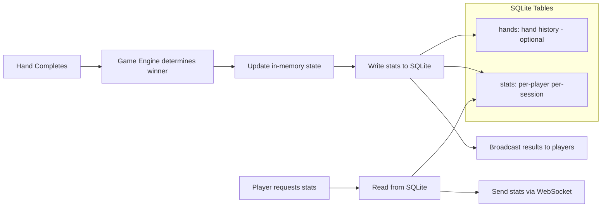

# SQLite Integration Research

## Overview

The app needs to store per-session player statistics (hands played, hands won, biggest pot, etc.) in SQLite. The database is write-light (stats updated at end of each hand) and read-light (stats queried when players ask or at game end). The challenge is integrating SQLite with a real-time WebSocket application cleanly.

## Options Considered

### 1. `better-sqlite3` (Synchronous)

Synchronous, native SQLite bindings for Node.js.

- **API:** Synchronous — `db.prepare(sql).run(params)`
- **Dependencies:** 1 (native addon, prebuilt binaries)
- **Performance:** Fastest SQLite library for Node.js
- **Benefit:** No callbacks, no promises, no async — just call and get result
- **Downside:** Native addon requires build tools (usually pre-built binaries available)

```js
const Database = require('better-sqlite3');
const db = new Database('poker.db');

db.exec(`CREATE TABLE IF NOT EXISTS stats (
  session_id TEXT, player_name TEXT, hands_played INTEGER DEFAULT 0,
  hands_won INTEGER DEFAULT 0, biggest_pot INTEGER DEFAULT 0
)`);

const updateStats = db.prepare(
  'UPDATE stats SET hands_won = hands_won + 1 WHERE session_id = ? AND player_name = ?'
);
updateStats.run(sessionId, playerName);
```

### 2. `sql.js` (WASM, no native code)

SQLite compiled to WebAssembly. Runs in pure JS, no native addon.

- **API:** Synchronous
- **Dependencies:** 1 (pure JS/WASM)
- **Performance:** Slower than native, but fine for light use
- **Benefit:** No build tools needed, works everywhere
- **Downside:** Must manually save database to file (in-memory by default)

### 3. `sqlite3` (Async, callback-based)

The original Node.js SQLite binding. Async with callbacks.

- **API:** Callback-based — `db.run(sql, params, callback)`
- **Dependencies:** 1 (native addon)
- **Performance:** Good
- **Downside:** Callback hell, verbose, outdated patterns

### 4. `knex` or other query builders

Higher-level abstraction over SQLite.

- **Dependencies:** Many (knex + driver + transitive)
- **Benefit:** Migrations, query building, portability
- **Downside:** Massive overkill for 2-3 simple tables

## Comparison

| Criteria | better-sqlite3 | sql.js | sqlite3 | knex |
|----------|---------------|--------|---------|------|
| API style | Sync | Sync | Async callbacks | Async/promise |
| Native addon | Yes | No (WASM) | Yes | Yes (via driver) |
| Performance | Best | Good | Good | Good |
| Simplicity | Highest | High | Low | Low |
| Dependencies | 1 | 1 | 1 | Many |
| File persistence | Automatic | Manual save | Automatic | Automatic |

## Data Flow



## Recommendation: `better-sqlite3`

**Use `better-sqlite3` for synchronous, zero-complexity database access.**

### Rationale

1. **Synchronous API eliminates async complexity:** No promises, no awaits, no callback chains. Call a function, get a result. This is critical — the game logic is synchronous, and mixing async DB calls into a synchronous state machine adds unnecessary complexity.
2. **Fastest Node.js SQLite:** Not that performance matters here, but it's a bonus.
3. **Prepared statements are simple:** `db.prepare(sql)` returns a reusable statement object.
4. **Transactions are trivial:** `db.transaction(fn)()` wraps multiple writes atomically.
5. **One dependency:** That's it.

### Why synchronous is fine

The concern with sync I/O is blocking the event loop. But for this use case:
- Writes happen once per hand (~every 30-60 seconds per room)
- Each write is a single row update (~0.1ms for SQLite)
- At 10 simultaneous rooms, that's ~10 writes per minute
- SQLite with WAL mode handles this trivially without blocking

### Schema

```sql
CREATE TABLE IF NOT EXISTS sessions (
  id TEXT PRIMARY KEY,
  room_code TEXT NOT NULL,
  created_at TEXT DEFAULT (datetime('now')),
  ended_at TEXT
);

CREATE TABLE IF NOT EXISTS player_stats (
  id INTEGER PRIMARY KEY AUTOINCREMENT,
  session_id TEXT NOT NULL,
  player_name TEXT NOT NULL,
  hands_played INTEGER DEFAULT 0,
  hands_won INTEGER DEFAULT 0,
  biggest_pot INTEGER DEFAULT 0,
  final_position INTEGER,
  peak_chips INTEGER DEFAULT 0,
  FOREIGN KEY (session_id) REFERENCES sessions(id)
);

CREATE INDEX idx_stats_session ON player_stats(session_id);
```

### Integration Pattern

```js
const Database = require('better-sqlite3');
const db = new Database('./data/poker.db', { /* WAL mode for better concurrency */ });
db.pragma('journal_mode = WAL');

// Prepared statements (created once, reused)
const insertSession = db.prepare(
  'INSERT INTO sessions (id, room_code) VALUES (?, ?)'
);
const upsertPlayer = db.prepare(`
  INSERT INTO player_stats (session_id, player_name)
  VALUES (?, ?)
  ON CONFLICT DO NOTHING
`);
const recordWin = db.prepare(`
  UPDATE player_stats 
  SET hands_won = hands_won + 1, biggest_pot = MAX(biggest_pot, ?)
  WHERE session_id = ? AND player_name = ?
`);
const incrementHands = db.prepare(`
  UPDATE player_stats SET hands_played = hands_played + 1
  WHERE session_id = ? AND player_name = ?
`);

// Called at end of each hand
function recordHandResult(sessionId, players, winnerId, potSize) {
  const txn = db.transaction(() => {
    for (const p of players) {
      incrementHands.run(sessionId, p.name);
    }
    recordWin.run(potSize, sessionId, winnerId);
  });
  txn();
}
```

### When to write

- **Session start:** Insert session row + player_stats rows
- **Hand end:** Increment hands_played for all, hands_won for winner, update biggest_pot
- **Game end:** Record final_position for each player, update ended_at
- **Never during gameplay:** No writes during betting rounds — zero risk of blocking

### Tradeoffs

- **Native addon:** Requires Node.js native build tools. Pre-built binaries usually cover macOS/Linux/Windows. If they don't, `sql.js` (WASM) is the fallback.
- **No migrations tool:** Schema changes are manual `ALTER TABLE` or recreation. Fine for a small schema that rarely changes.
- **No ORM:** Raw SQL everywhere. For 3 tables with simple queries, this is simpler than any ORM.
- **Single-writer:** SQLite doesn't support concurrent writers well. With one process and WAL mode, this is a non-issue.

### Backup

The database is a single file (`poker.db`). Copy it to back up. No infrastructure needed.
