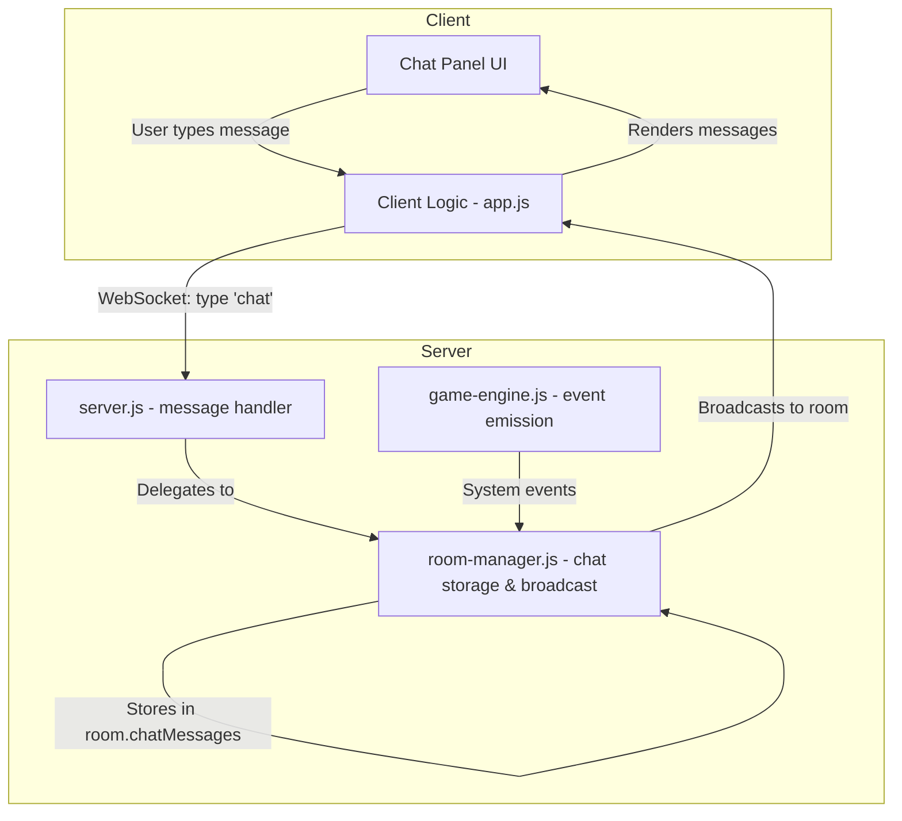

# Detailed Design: Room-Based Chat

## Overview

This document describes the design for a live, room-based chat feature for the Multiplayer Poker application. The chat allows players in the same room to communicate in real-time via text messages, with game events displayed inline. The chat is available from the moment a player joins a room (lobby phase) and persists in memory for the room's lifetime.

## Detailed Requirements

1. **Room-only visibility** — All chat messages are broadcast to every player at the table. No private messaging.
2. **Session-persistent** — Messages are stored in memory for the room's lifetime. Reconnecting players receive the full chat history.
3. **No moderation** — No profanity filtering, rate limiting, or mute functionality.
4. **Game events inline** — All game events (join/leave, game start, new hand, player actions, phase transitions, showdown results, all-in) appear as system messages in the chat feed.
5. **Visually distinct system messages** — Game events are styled differently from player messages (italicized, muted color).
6. **Collapsible panel** — The chat UI is a toggleable side panel that can be shown or hidden.
7. **No notifications** — When the panel is collapsed, no unread indicators are shown.
8. **No timestamps** — Messages display only the sender name and content.
9. **No message length limit** — Players can send messages of any length.
10. **Available from lobby** — Chat is active as soon as a player joins a room, before the game starts.
11. **No collusion safeguards** — Trusted environment; no restrictions on message content.

## Architecture Overview



## Components and Interfaces

### Server-Side

#### 1. Chat Message Handler (server.js)

New case in `handleMessage()`:

```javascript
case 'chat': {
  const room = getRoomByPlayerId(playerId);
  if (!room) {
    ws.send(JSON.stringify({ type: 'error', message: 'Not in a room' }));
    break;
  }
  const player = room.players.find(p => p.id === playerId);
  if (!player) break;
  broadcastChatMessage(room, {
    sender: player.displayName,
    text: msg.text,
    isSystem: false,
  });
  break;
}
```

#### 2. Chat Storage & Broadcasting (room-manager.js)

New property on room object:
```javascript
chatMessages: []  // Array of { sender, text, isSystem }
```

New exported functions:
```javascript
function broadcastChatMessage(room, message) {
  room.chatMessages.push(message);
  const payload = JSON.stringify({ type: 'chat', message });
  for (const p of [...room.players, ...room.spectators]) {
    if (p.ws && p.ws.readyState === 1) {
      p.ws.send(payload);
    }
  }
}

function addSystemMessage(room, text) {
  broadcastChatMessage(room, { sender: null, text, isSystem: true });
}
```

Chat history delivery on rejoin — include `chatMessages` in the room state sent to reconnecting players:
```javascript
// In sendFilteredState or as a separate message after rejoin
{ type: 'chatHistory', messages: room.chatMessages }
```

#### 3. Game Event Emission (game-engine.js)

Call `addSystemMessage(room, text)` at each game event point:

| Event | Message Text |
|-------|-------------|
| Player joins | `"PlayerName joined the room"` |
| Player leaves | `"PlayerName left the room"` |
| Game started | `"Game started!"` |
| New hand dealt | `"Hand #N dealt"` |
| Player folds | `"PlayerName folded"` |
| Player checks | `"PlayerName checked"` |
| Player calls | `"PlayerName called $X"` |
| Player bets | `"PlayerName bet $X"` |
| Player raises | `"PlayerName raised to $X"` |
| Player all-in | `"PlayerName is all in!"` |
| Flop dealt | `"Flop: [cards]"` |
| Turn dealt | `"Turn: [card]"` |
| River dealt | `"River: [card]"` |
| Showdown winner | `"PlayerName wins $X with HandName"` |

### Client-Side

#### 4. Chat Panel (index.html)

A new collapsible panel added to the game screen and waiting room:

```html
<div id="chatPanel" class="chat-panel collapsed">
  <button id="chatToggle" class="chat-toggle">💬 Chat</button>
  <div class="chat-body">
    <div id="chatMessages" class="chat-messages"></div>
    <div class="chat-input-area">
      <input type="text" id="chatInput" placeholder="Type a message...">
      <button id="chatSendBtn">Send</button>
    </div>
  </div>
</div>
```

#### 5. Client Logic (app.js)

New message handlers:
- `case 'chat'` — append a single message to the chat feed
- `case 'chatHistory'` — render all historical messages (on rejoin)

Send function:
```javascript
function sendChat() {
  const input = document.getElementById('chatInput');
  const text = input.value.trim();
  if (!text) return;
  send({ type: 'chat', text });
  input.value = '';
}
```

Toggle function:
```javascript
function toggleChat() {
  const panel = document.getElementById('chatPanel');
  panel.classList.toggle('collapsed');
}
```

Render function:
```javascript
function appendChatMessage(message) {
  const container = document.getElementById('chatMessages');
  const div = document.createElement('div');
  div.className = message.isSystem ? 'chat-msg system' : 'chat-msg player';
  if (message.isSystem) {
    div.textContent = message.text;
  } else {
    div.innerHTML = `<strong>${escapeHtml(message.sender)}</strong>: ${escapeHtml(message.text)}`;
  }
  container.appendChild(div);
  container.scrollTop = container.scrollHeight;
}
```

#### 6. Styling (style.css)

```css
.chat-panel {
  position: fixed;
  right: 0;
  top: 0;
  bottom: 0;
  width: 300px;
  display: flex;
  flex-direction: column;
  background: #1a1a2e;
  border-left: 1px solid #333;
  transition: transform 0.3s ease;
  z-index: 100;
}

.chat-panel.collapsed {
  transform: translateX(100%);
}

.chat-panel.collapsed .chat-toggle {
  transform: translateX(-100%);
}

.chat-toggle {
  position: absolute;
  left: -40px;
  top: 50%;
  transform: translateY(-50%);
  /* styling details */
}

.chat-messages {
  flex: 1;
  overflow-y: auto;
  padding: 10px;
}

.chat-msg.system {
  font-style: italic;
  color: #888;
  padding: 2px 0;
}

.chat-msg.player {
  padding: 4px 0;
  color: #eee;
}

.chat-input-area {
  display: flex;
  padding: 8px;
  border-top: 1px solid #333;
}
```

## Data Models

### Chat Message

```typescript
interface ChatMessage {
  sender: string | null;  // null for system messages
  text: string;           // message content
  isSystem: boolean;      // true for game events, false for player messages
}
```

### Room (extended)

```typescript
interface Room {
  // ... existing properties ...
  chatMessages: ChatMessage[];  // session-persistent chat history
}
```

## Error Handling

| Scenario | Handling |
|----------|----------|
| Player sends chat but not in a room | Return error message to sender |
| Player sends empty message | Client-side validation prevents sending |
| WebSocket disconnects | Messages continue to accumulate; on rejoin, full history is sent |
| Room is destroyed | Chat messages are garbage collected with the room |
| Very long message | No limit enforced; CSS handles overflow with word-wrap |

## Testing Strategy

### Unit Tests
- Chat message storage: verify messages are pushed to `room.chatMessages`
- Broadcasting: verify all players in a room receive the message
- System message generation: verify correct text for each game event
- Chat history on rejoin: verify full history is sent to reconnecting player
- Isolation: verify chat from one room is not visible in another room

### Integration Tests
- End-to-end flow: player sends message → all room members receive it
- Reconnection: player disconnects → reconnects → receives chat history
- Game events: game actions trigger system messages in chat
- Chat during all phases: lobby, preflop through showdown

### Manual/UI Tests
- Panel collapse/expand toggle works
- Messages auto-scroll to bottom
- System messages are visually distinct
- Chat input clears after sending
- Chat works on both waiting room and game screens
- Long messages wrap properly

## Appendices

### Technology Choices

No new dependencies are needed. The feature is built entirely on:
- **WebSocket (ws)** — already used for all real-time communication
- **In-memory storage** — consistent with the room lifecycle model
- **Vanilla JS + CSS** — consistent with existing client code

### Alternative Approaches Considered

| Approach | Pros | Cons | Decision |
|----------|------|------|----------|
| Separate chat WebSocket | Isolation from game traffic | Extra connection overhead, complexity | Rejected — single WS is simpler |
| Store chat in database | Persistence beyond session | Unnecessary for requirements, adds I/O | Rejected — session-persistent only |
| Include chat in roomState broadcasts | Simpler protocol | Redundant data on every state update | Rejected — separate message type is more efficient |
| Separate chat message type | Efficient, targeted updates | Slightly more code | **Chosen** |

### Key Constraints
- Chat is entirely in-memory — if the server restarts, chat history is lost (acceptable per requirements)
- No authentication beyond the existing player ID — trusted environment
- Maximum 8 players per room limits broadcast fan-out
