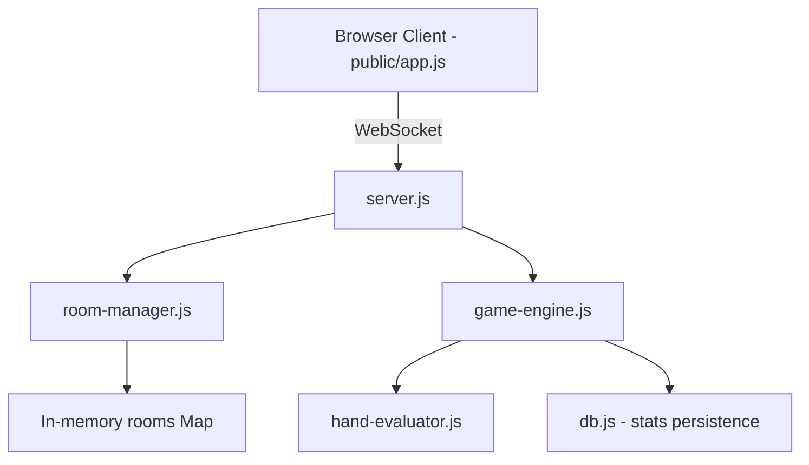

# Existing Codebase Research

## Architecture Overview

The poker game uses a standard Node.js + Express + WebSocket architecture:

## Key Findings

### WebSocket Message Protocol

The existing system uses a JSON message protocol over WebSocket:
- **Client → Server**: `{ type: 'create' | 'join' | 'leave' | 'rejoin' | 'start' | 'action', ... }`
- **Server → Client**: `{ type: 'connected' | 'roomCreated' | 'roomState' | 'yourTurn' | 'showdown' | 'handWon' | 'gameOver' | 'error', ... }`

Adding a `chat` message type fits naturally into this protocol.

### Room Structure

Rooms are stored in an in-memory `Map`. Each room has:
- `players[]` — array of player objects with `id`, `ws`, `displayName`, etc.
- `spectators[]` — array of spectator objects
- `phase` — current game phase ('waiting', 'preflop', 'flop', 'turn', 'river', 'showdown', 'gameOver')

Chat messages can be stored as a new array property on the room object (e.g., `room.chatMessages`).

### Broadcasting Pattern

The `broadcastRoomState()` function iterates over all players and spectators and sends filtered state. A similar `broadcastChat()` function can follow the same pattern.

### Client Architecture

The client is a single IIFE in `public/app.js` with:
- WebSocket connection management with auto-reconnect
- Message handler switch statement
- Screen management (landing, waitingRoom, gameScreen, gameOverScreen)
- DOM rendering functions

Adding chat requires:
- A new `case 'chat'` in the message handler
- A new DOM panel (collapsible)
- A send input/button

### Reconnection Support

The app already supports reconnection via `rejoin`. Since chat is session-persistent, the chat history can be sent as part of the rejoin response or room state.

## Integration Points

1. **server.js** `handleMessage()` — add `case 'chat'` to broadcast messages
2. **room-manager.js** — add `chatMessages[]` to room object, add broadcast helper
3. **game-engine.js** — emit system messages to chat when game events occur
4. **public/app.js** — add chat UI panel, message handling, and send functionality
5. **public/index.html** — add chat panel HTML structure
6. **public/style.css** — add chat panel styling

## Conclusion

The existing architecture makes this a straightforward addition. No new dependencies are needed — the WebSocket infrastructure is already in place, and the room-based model naturally scopes chat to room participants.
